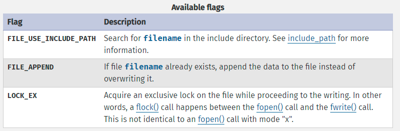
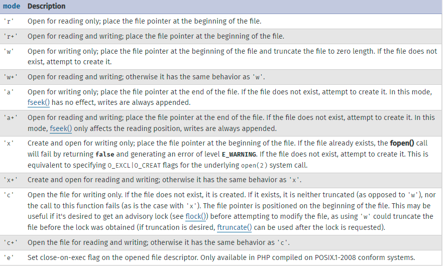

# file system
PHP can handle what we do using terminals in our device. for example: make a folder/file, open a folder/file, delete a folder/file, rename a folder/file, etc..

# file system functions:
[docs](https://www.php.net/manual/en/ref.filesystem.php)

## `file_exists`:
### what is it?
check if a certain file, directory is exists somewhere (path).

### syntax
`file_exists(string $filename): bool`

where:
- filename: Path to the file or directory.

### example:
```
$file_name = '../css/style.css';

if(file_exists($file_name)){
    echo "yes (" . $file_name . ") is exists";
}
```

## `file_put_contents`:
### what is it?
add a content to a file if file exist else, it will create it and add the content.

### syntax
```
file_put_contents(
    string $filename,
    mixed $data,
    int $flags = 0,
    ?resource $context = null
): int|false
```

where:
- filename: Path to the file where to write the data.
- data: The data to write. Can be either a string, an array or a stream resource.

*If data is a stream resource, the remaining buffer of that stream will be copied to the specified file. This is similar with using stream_copy_to_stream().*

*You can also specify the data parameter as a single dimension array. This is equivalent to file_put_contents($filename, implode('', $array)).*

- flags: The value of flags can be any combination of the following flags, joined with the binary OR (|) operator.



- context: A valid context resource created with `stream_context_create()`.

### example:
```
$file_name = '../css/style.css';

if(file_exists($file_name)){
    echo "yes (" . $file_name . ") is exists";
    file_put_contents($file_path, "h1{color:yellow}");

}else{
    file_put_contents($file_path, "h1{color:yellow}");
}
```

## `is_writable`:
### what is it?
Tells whether the filename is writable.
### syntax:
`is_writable(string $filename): bool`

where:
- filename: The filename being checked.
### example:
```
$file_path = '../css/style.css';

if(file_exists($file_path)){
    if(is_writable($file_path)){
        echo "<h1>yes (" . end($file_path_explode) . ") is exists and writable</h1>";
    }else{
        echo "<h1>no, not exist and not writable</h1>";
    }  
}
```

## `mkdir, rmdir, is_dir`:
### what is it?
- `mkdir:` Makes directory.
- `rmdir:` remove directory.(only if it is empty)
- `is_dir:` check if directory is exist or not. Tells whether the filename is a directory
### syntax:
1. `mkdir: `
```
mkdir(
    string $directory,
    int $permissions = 0777,
    bool $recursive = false,
    ?resource $context = null
): bool
```

where:
- directory: The directory path.
- permissions: The permissions are 0777 by default, which means the widest possible access.
**permissions is ignored on Windows.**
- recursive: Allows the creation of nested directories specified in the directory.
- context: A context stream resource.

2. `rmdir: `

```
rmdir(string $directory, ?resource $context = null): bool
```

where:
- directory: Path to the directory.
- context: A context stream resource.
**Attempts to remove the directory named by directory. The directory must be empty, and the relevant permissions must permit this.**

3. `is_dir:`
```
is_dir(string $filename): bool
```
where:
- filename: Path to the file. If filename is a relative filename, it will be checked relative to the current working directory. If filename is a symbolic or hard link then the link will be resolved and checked.
### example:
```
$user_name = "abrar";
if(is_dir("../" . $user_name)){ 
    echo "yes the directory is found and i will remove it" . "<br>";
    rmdir("../" . $user_name);
}else{
    echo "not found and i will create it" . "<br>";
    mkdir("../" . $user_name);
}
```

## `dirname`:
### what is it?
Returns a parent directory's path.

### syntax
`dirname(string $path, int $levels = 1): string`

where:
- path: A path.
- levels: The number of parent directories to go up. *This must be an integer greater than 0.*

**note: Be careful when using this function in a loop that can reach the top-level directory as this can result in an infinite loop.**
```
<?php
dirname('.');    // Will return '.'.
dirname('/');    // Will return `\` on Windows and '/' on *nix systems.
dirname('\\');   // Will return `\` on Windows and '.' on *nix systems.
dirname('C:\\'); // Will return 'C:\' on Windows and '.' on *nix systems.
?>
```

### example:
```
$file_path = "C:/xampp/htdocs/learnPHP/images/file_put_content_flags.PNG";
echo dirname($file_path, 2); //C:/xampp/htdocs/learnPHP
```

## `basename`:
### what is it?
Returns the name of file

### syntax
`basename(string $path, string $suffix = ""): string`

where:
- path: A path.
- suffix: If the name component ends in suffix/ extension this will also be cut off.

**note: Be careful when using this function in a loop that can reach the top-level directory as this can result in an infinite loop.**
```
<?php
dirname('.');    // Will return '.'.
dirname('/');    // Will return `\` on Windows and '/' on *nix systems.
dirname('\\');   // Will return `\` on Windows and '.' on *nix systems.
dirname('C:\\'); // Will return 'C:\' on Windows and '.' on *nix systems.
?>
```

### example:
```
$file_path = "C:/xampp/htdocs/learnPHP/images/file_put_content_flags.PNG";
echo basename($file_path, ".PNG"); //file_put_content_flags
```

## `chmod`:
### what is it?
Changes file mode.

### syntax
`chmod(string $filename, int $permissions): bool`

where:
- filename: Path to the file.
- permissions: Note that permissions is not automatically assumed to be an octal value, so to ensure the expected operation, you need to prefix permissions with a zero (0). Strings such as "g+w" will not work properly.
```
<?php
chmod("/somedir/somefile", 755);   // decimal; probably incorrect
chmod("/somedir/somefile", "u+rwx,go+rx"); // string; incorrect
chmod("/somedir/somefile", 0755);  // octal; correct value of mode
?>
```
[see some permission](https://www.thegeeksearch.com/understanding-octal-permission-bits-in-linux/)

### example:
```
$file_path = "C:/xampp/htdocs/learnPHP/images/file_put_content_flags.PNG";
chmod("/somedir/somefile", 0755);
```

## `file_get_content`:
### what is it?
Reads the content of the file and return it into a string.

### NOTE:
- `file_get_contents()` is the preferred way to read the contents of a file into a string. It will use memory mapping techniques if supported by your OS to enhance performance.
- This function may return Boolean false, but may also return a non-Boolean value which evaluates to false. Please read the section on Booleans for more information. Use the === operator for testing the return value of this function.
- An E_WARNING level error is generated if filename cannot be found, length is less than zero, or if seeking to the specified offset in the stream fails.
- When file_get_contents() is called on a directory, an E_WARNING level error is generated on Windows, and as of PHP 7.4 on other operating systems as well.

### syntax
```
file_get_contents(
    string $filename,
    bool $use_include_path = false,
    ?resource $context = null,
    int $offset = 0,
    ?int $length = null
): string|false
```
where:
- filename: Name of the file to read.
- use_include_path:
- context: A valid context resource created with stream_context_create(). If you don't need to use a custom context, you can skip this parameter by null.
- offset: The offset where the reading starts on the original stream. Negative offsets count from the end of the stream.

Seeking (offset) is not supported with remote files. Attempting to seek on non-local files may work with small offsets, but this is unpredictable because it works on the buffered stream.

- length: Maximum length of data read. The default is to read until end of file is reached. Note that this parameter is applied to the stream processed by the filters.

### example:
```
$file_content = file_get_contents("../test/text.txt");
echo $file_content;
```

## `rename`:
### what is it?
Renames a file or directory. you can use it move file from path to another one.

### syntax
`rename(string $from, string $to, ?resource $context = null): bool`
where:
- from: The old name.
- to: The new name.
- context: A context stream resource.

### notes:
- On Windows, if to already exists, it must be writable. Otherwise rename() fails and issues E_WARNING.
- The wrapper used in from must match the wrapper used in to.

### example:
```
$file = "../test/text3.txt";
rename($file, "../test/text_new.txt");
```

## `copy`:
### what is it?
Copies file. (not directory) 

### syntax
`copy(string $from, string $to, ?resource $context = null): bool`
where:
- from: : Path to the source file.
- to: The destination path. If to is a URL, the copy operation may fail if the wrapper does not support overwriting of existing files.
- context: A valid context resource created with stream_context_create().

### notes:
- if the destination file already exists, it will be overwritten.

### example:
```
$file = "../test/text2.txt";
copy($file, "../test/text2_copy.txt");
```

## `pathinfo`:
### what is it?
Returns information about a file path.

### syntax
`pathinfo(string $path, int $flags = PATHINFO_ALL): array|string`

where:
- path: The path to be parsed.
- flags: If present, specifies a specific element to be returned; one of `PATHINFO_DIRNAME`, `PATHINFO_BASENAME`, `PATHINFO_EXTENSION` or `PATHINFO_FILENAME`.

If flags is not specified, returns all available elements.

### notes:
- `pathinfo()` returns information about path: either an associative array or a string, depending on flags.
- `pathinfo()` operates naively on the input string, and is not aware of the actual filesystem, or path components such as "..".
- `pathinfo()` is locale aware.
- [see doc example](https://www.php.net/manual/en/function.pathinfo) for more useful examples.
### example:
```
$path = "C:/xampp/htdocs/learnPHP/notes/arrays.md";
$info = pathinfo($path);
print_r($info);
```

## `unlink`:
### what is it?
Deletes a file.

### syntax
`unlink(string $filename, ?resource $context = null): bool`

where:
- filename: Path to the file.
- context: A context stream resource.

### notes:
- If the file is a `symlink`, the `symlink` will be deleted. On Windows, to delete a `symlink` to a directory, `rmdir()` has to be used instead.
- If flags is not specified, returns all available elements.

### example:
```
unlink("../test/abrar.txt");
```

## `scandir`:
### what is it?
List files and directories inside the specified path.

like: `ls` in ubuntu, and `dir` command in windows terminal.
### syntax
`scandir(string $directory, int $sorting_order = SCANDIR_SORT_ASCENDING, ?resource $context = null): array|false`

where:
- directory: The directory that will be scanned.
- sorting_order: By default, the sorted order is alphabetical in ascending order. If the optional `sorting_order` is set to `SCANDIR_SORT_DESCENDING`, then the sort order is alphabetical in descending order. If it is set to `SCANDIR_SORT_NONE` then the result is unsorted.
- context

### notes:
- Returns an array of files and directories from the directory.

### example:
```
$path = "../notes";
$directory_info = scandir($path);
print_r($directory_info);
```

## `fopen`:
### what is it?
Opens file or URL.
### syntax
```
fopen(
    string $filename,
    string $mode,
    bool $use_include_path = false,
    ?resource $context = null
): resource|false
```
where:
- filename: The file path or link.
- mode: 
    - r: read only 
        - file must be exist to read from it,
        - it will read from the beginning of the file
        - if file not exist it will rise an error
    - r+: read and write 
        - file must be exist to read/write from it
        -  it will read/write from the beginning of the file
        - if file not exist it will rise an error
    - w: write only 
        - it will open the file, clear all it's previous content and write over it
        - if the file not exist it will create it
    - w+: write and read 
        - it will open the file, clear all it's previous content and write over it
        - if the file not exist it will create it
    - a: write only
        - it will open the file, and write after the end of the file (add a new content to the previous one)
        - if the file not exist it will create it
    - a+: write and read
        - it will open the file, and write after the end of the file (add a new content to the previous one)
        - if the file not exist it will create it
    - x: write only
        - it will open the file, and write after the end of the file (add a new content to the previous one) **the file must be not exist created for the first time**
        - if the file not exist it will create it
    - x+: write and read
        - it will open the file, and write after the end of the file (add a new content to the previous one) **the file must be not exist created for the first time**
        - if the file not exist it will create it



- use_include_path: The optional third use_include_path parameter can be set to '1' or true if you want to search for the file in the include_path, too.
- context: A context stream resource.

### notes:
- On the Windows platform, be careful to escape any backslashes used in the path to the file, or use forward slashes.
- Unix based systems use \n as the line ending character, Windows based systems use \r\n as the line ending characters and Macintosh based systems (Mac OS Classic) used \r as the line ending character.
- The mode is ignored for `php://output`, `php://input`, `php://stdin`, `php://stdout`, `php://stderr` and `php://fd` stream wrappers.
- You should insert a call to `clearstatcache()` before calling `filesize()`, this comment from Anonymous in https://www.php.net/manual/en/function.filesize.php
- However, if you always specify the FULL PATH
```
e.g. $fs = filesize("/user/some/path/error_log");
this comment from John Crocker in https://www.php.net/manual/en/function.filesize.php
```

### example:
```
$path = "../notes/arrays.md";
echo "<p>" . fopen($path, "r+") . "</p>";
```

## `fread`:
### what is it?
Binary-safe file read.

### syntax
`fread(resource $stream, int $length): string|false`

where:
- stream: A file system pointer resource that is typically created using `fopen()`.
- length: Up to length number of bytes read.

### notes:
- `fread()` reads up to length bytes from the file pointer referenced by stream. Reading stops as soon as one of the following conditions is met:
    - length bytes have been read
    - EOF (end of file) is reached
- You should insert a call to `clearstatcache()` before calling `filesize()`, this comment from Anonymous in https://www.php.net/manual/en/function.filesize.php
- However, if you always specify the FULL PATH
```
e.g. $fs = filesize("/user/some/path/error_log");
this comment from John Crocker in https://www.php.net/manual/en/function.filesize.php
```

### example:
```
$path = "../test/text2_copy.txt";
$opend_file = fopen($path, "r");
$file_size = filesize($path);
$file_content = fread($opend_file, $file_size);
echo $file_content;
fclose($opend_file);
```

## `fwrite`:
### what is it?
Binary-safe file write.

### syntax
`fwrite(resource $stream, string $data, ?int $length = null): int|false`

where:
- stream: A file system pointer resource that is typically created using `fopen()`.
- data: The string that is to be written.
- length: If length is an integer, writing will stop after length bytes have been written or the end of data is reached, whichever comes first.

### notes:
- `fread()` reads up to length bytes from the file pointer referenced by stream. Reading stops as soon as one of the following conditions is met:
    - length bytes have been read
    - EOF (end of file) is reached
- You should insert a call to `clearstatcache()` before calling `filesize()`, this comment from Anonymous in https://www.php.net/manual/en/function.filesize.php
- However, if you always specify the FULL PATH
```
e.g. $fs = filesize("/user/some/path/error_log");
this comment from John Crocker in https://www.php.net/manual/en/function.filesize.php
```

### example:
```
$path = "../test/text_write.txt";
$opend_file = fopen($path, "w");
$content = "ADD this content into the file by fwrite (w) mode";
fwrite($opend_file, $content);
$file_content = file_get_contents($path);
echo $file_content;
fclose($opend_file);
```

## `fseek`:
### what is it?
Seeks on a file pointer.

### syntax
`fseek(resource $stream, int $offset, int $whence = SEEK_SET): int`

where:
- stream: A file system pointer resource that is typically created using `fopen()`.
- offset: The offset.
- whence: whence values are:
    - SEEK_SET - Set position equal to offset bytes.
    - SEEK_CUR - Set position to current location plus offset.
    - SEEK_END - Set position to end-of-file plus offset.

### notes:
- Sets the file position indicator for the file referenced by stream. The new position, measured in bytes from the beginning of the file, is obtained by adding offset to the position specified by whence.
- To move to a position before the end-of-file, you need to pass a negative value in offset and set whence to SEEK_END.
- Upon success, returns 0; otherwise, returns -1.
- If you have opened the file in append (a or a+) mode, any data you write to the file will always be appended, regardless of the file position, and the result of calling `fseek()` will be undefined.
- **a super note from: seeker at example com at php.com**:
    - DON'T open the file in mode "a" (for append), because it puts
    the file pointer at the end of the file and doesn't let you
    `fseek()` earlier positions in the file (it didn't for me!). Also,
    don't open the file in mode "w" -- although this puts you at
    the beginning of the file -- because it wipes out all data in
    the file.
- You should insert a call to `clearstatcache()` before calling `filesize()`, this comment from Anonymous in https://www.php.net/manual/en/function.filesize.php
- However, if you always specify the FULL PATH
```
e.g. $fs = filesize("/user/some/path/error_log");
this comment from John Crocker in https://www.php.net/manual/en/function.filesize.php
```

### example:
```
echo "<h1 class='subject'>fseek</h1>";
$path = "../test/text_write.txt";
$opend_file = fopen($path, "r+");
$file_size = filesize($path);
fseek($opend_file, 34, SEEK_SET); // or fseek($opend_fike, -15, SEEK_END)
$content = "fseek at pos34 (r+) mode";
fwrite($opend_file, $content);
```

## `fclose`:
### what is it?
Closes an open file pointer.

### syntax
`fclose(resource $stream): bool`

where:
- stream: A file system pointer resource that is typically created using `fopen()`.

### notes:
- Returns true on success or false on failure.
- You should insert a call to `clearstatcache()` before calling `filesize()`, this comment from Anonymous in https://www.php.net/manual/en/function.filesize.php
- However, if you always specify the FULL PATH
```
e.g. $fs = filesize("/user/some/path/error_log");
this comment from John Crocker in https://www.php.net/manual/en/function.filesize.php
```

### example:
```
$path = "../test/text_write.txt";
$opend_file = fopen($path, "w");
fclose($opend_file);
```